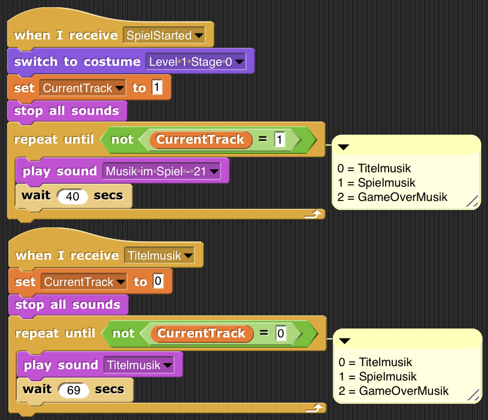

# 2D Puzzle Game
## Links

1. [Projektseite](https://github.com/ThorgeHamprecht/Informatik-Projekt-Nr.-1/blob/main/2D%20Puzzle%20Game.md)
2. [Spiel - Snap! Cummunity Site](https://snap.berkeley.edu/project?user=faiture&project=2D%20Puzzle%20Game)

## Über Snap!

## Spielkonzept
Bei x handelt es sich um ein 2D Adventure Spiel mit Puzzle und Platform Elementen. Der Spieler hat dabei die Aufgabe das Ende des Levels durch das Lösen von "Rätslen" und bewältigen von Platform-Passagen zu erreichen.

**Das Setup**

Bevor das Spiel startet, hat der Spieler die Möglichekit sich in dem Startmenü im Zuge der Anleitung über das Spielprinzip, das Spielziel und das Steuern der Spielfigur zu informieren.
Anschließend hat der Spieler die Möglichkeit sich über den Button "Charakter Wählen" eine beliebige Spielfigur auszusuchen.
Dabei gibt es drei Figuren zur Wahl.

**Spielstart**

Fühlt sich der Spieler bereit, so kann er über die Betätigung des Buttons "Spiel Starten" das Spiel beginnen.
Folglich befindet sich die Spielfigur in der Stage 0 sowie im ersten Level.
Die Spielfigur kann auf der braunen Unterfläche nach rechts und links laufen. Zudem besteht die Möglichkeit mit Betätigung der Taste "S" oder dem Leerzeichen zu springen.
Oben links in der Ecke sind die drei Leben der Spielfigur angezeigt. Diese werden, z.B. bei Berührung der Lava oder der Laserstrahlen weniger, bis die Spielfigur schließlich stirbt und das Spiel vorbei ist.

**Spielkonzept/Spielziel**

Der Spieler wird nun die Spielfigur in die verschiedenen Richtungen steuern. 
Das Ziel des Spiels ist es, das Level zu schaffen.
Dafür muss der Spieler es schaffen Punkt X zu erreichen. Wie der Spieler seine Spielfigur dort hinsteuert, muss er selbst herrausfinden.
Auf dem Weg zum Schaffen des Levels erwarten den Spieler viele Herrausfoderungen. 
Beispielsweise muss an einer Stelle ein Schlüssel gefunden werden, um ein Tor zu öffnen. Zudem muss der Spieler es schaffen, dass seine Spielfigur nicht in die Lava tritt und nicht von den Laserstrahlen getroffen wird.

Mit diesem Spielkonzept ist unsere Absicht ein spannendes, kreatives und Reizvolles 2D Spiel zu entwerfen, welches für den Spieler sowohl fordern als machbar ist.

## Die Erklärung des Codes

<u><b>Die Grundeigenschaften der Spielfigur</u></b>

***1. Grundeinstellungen für die Spielfigur***

Die Spielfigur ist nicht zu sehen, wenn das Spiel gewonnen wurde, wenn die grüne Fahne gedrückt wird und wenn sich der Spieler im Menü befindet.

Sprite Spieler - hide 

 
 

Wenn das Spiel gestartet wird, wird die Größe der Spielfigur auf 20% der Ursprungsgröße gesetzt, die X- und Y- Koordinaten werden mit 0;-60 festgelegt, die Blickrichtung ist nach links XXXX Spielfigur befindet sich im Vordergrund.
Zudem wird sie nun logischerweise gezeigt.

Sprite Spieler - "when I receive SpielStartet"" 

 
 

***2. Bewegung des Spieler Objekts***

<BODY>
  
</BODY>

***2.1 Horizintale Bewegung der Spielfigur***

Immer wenn das Spiel gestartet wird ist die Bewegungsgeschwindigkeit 10.

Sprite Spieler - Bewegungsgeschwindigkeit 

 
 

Sobald das Spiel startet wird die Variable "SpielerBewegung" = 1 gesetzt. 

Sprite Spieler - Variable "SpielerBewegung" 

 
 

Anschließend ist für die hprzontale Bewegung der folgende Code relevant. Zunächst wird geprüft, ob die Variable "SpielerBewegung" =1 ist. Wenn dies der Fall ist, werden folgende Bedingunen geprüft.
Zunächst wird die Bewegungsrichtung rechts betrachtet.
Hier ergibt sich im Code eine Besonderheit, weil die Spielfigur sich nur nach rechts bewegen darf, wenn das Tor, welches sich in Stage 2 befindet offen ist. Somit wird zunächst geprüft, ob das Tor offen ist. XX 
Wenn das Tor offen ist und die rechte Pfeiltaste oder d auf der Tastatur gedrückt wird, dann wird die X-Koordinate mit der Bewegungsgeschwindigkeit 10 geändert. 
Dabei ändert sich an der Blickrichtung der Spielfigur nichts.

Die Bewgung nach links gestaltet sich leichter. Hier muss nicht geprüft werden, ob das Tor in Stage 2 offen ist.
Somit wird lediglich, wenn die SpielerBewegung = 1 ist, geprüft, ob der linke Pfeil auf der Tastatur gedrückt wird oder ob a auf der Tastatur betätigt wird.
Wenn dies der Fall ist, bewegt sich die Spielfigur in die negative Richtung auf der X-Achse mit der BEwegungsgeschwindigkeit 10.

Sprite Spieler - Horizontale Bewegung 

 

***2.2 Die Sprungeigenschaft der Spielfigur***

Sobald das Spiel gestartet wird, werden folgende **Variablen** definiert, die für den Sprung der Spielfigur wichtig sind:

Sprite Spieler - "when I recive "BerühreBoden"" 

 

 

Um das Springen der Spielfigur zu ermöglichen, haben wir uns einige Dinge überlegt.
Zunächst wird mit dem ersten Codeblock sobald das Spiel gestartet wird geprüft, ob die Spielfigur die BodenHitbox berührt. Dieser Sprite ist ein sehr dünner, grüner Streifen welcher nicht sichtbar ist:

 

<b>Erklärung Sprite Bodenhitbox</b>

 
  Sobald das Spiel gestartet wird, wird das Costume zu X geändert. Diese Costume ist die folgende gründe Linie.
Zudem wird eingestellt, dass die grüne Linie im Vordergrund ist, somit also Einfluss auf die Spielfigur hat.

 
 Sprite BodenHitbox - grüne Linie:
 

Des Weiteren ist der "ghost effect" 100. Somit ist die grüne Linie nicht zu sehen, erfüllt jedoch trotzdem seinen Zweck.
Zudem soll diese unsichtbare grüne Linie in jeder Stage Anwendung finden. Dies ist mit den folgenden Codes eingestellt. X (Wieso bei Game-Over?)
  

Wenn diese Bedingung zutrifft, wenn also zutrifft, dass die Spielfigur die unsichtbare, grüne Linie berührt wird der Spieler auf die Y-Achse -60 gestellt und die Variable "BerührtBoden" = 1 gesetzt.
Zudem wird "BerühreBoden" ausgeführt.
Berührt die Spielfigur nicht die "BodenHitbox" so wird die Variable "BerührtBoden = 0 gesetzt.

Code für "If touching BodenHitbox"

 

  

Der folgende Code beschreibt die Auswirkungen, wenn die Spielfigur den Boden berührt, "BerühreBoden" also ausgeführt ist.
In diesem Fall wird die Fallgeschwindigkeit = -3 gesetzt. 
Mit den folgenden drei Bedingungen wird das Springen eingestellt. Egal ob der Spieler die Leertaste, den Pfeil nach oben oder die Taste w betätigt, wird der Y-Wert um die zuvor definierte Sprungkraft geändert. Zudem wird der Befehl "gesprungen" ausgeführt.

Sprite Spieler - "when I recive "BerühreBoden"" 

 

 
 

Mit diesem Code werden die beiden vorherigen Bedingungen vorrausgesetzt. Der Code wird so lange ausgeführt wie die Variable "BerührtBoden" 0 ist, die Spielfigur also nicht die "BodenHitbox" berührt.
Dann wird die Fallgeschwindigkeit mit 1,2 multipliziert und die Y-Koordinate wird entsprechend geändert.
Dadurch erhöhrt sich die Fallgeschwindigkeit je länger sich die Spielfigur im Fall befindet. Dies soll den natürlichen Fall von implementieren.

Sprite Spieler - "when I recive "BerühreBoden"" 

 

 

## Lebensverlust der Spielfigur 

Im Folgenden wird das Prinzip des Lebensverlustes und des Erhaltens von Schaden beschrieben.
In unserem Spiel hat die Spielfigur drei Leben. Sind diese Leben verbraucht, so hat der Spieler verloren.
Die drei Leben befinden sich im oberen linken Eck des Spielrandes.

Der folgende Code soll beispielhaft die Funktion der Herzen erläutern.
Der Code codiert für die generellen Informationen des Herzens. Immer wenn das Spiel gestartet wird erscheint das Herz. Dies ist durch die Befehle "when I receive SpielStartet" und "switch costum to Herz" ausgedrückt. Durch den Befehl "set size to 20%" wird die Orginalgröße des Herzens auf dem ursprünglich eingefügten png-Bild auf 20% der Originalgröße herabgesetzt, damit alle drei Herzen nebeneinander passen.
Das Herz soll zudem im Vordergrund erscheinen. Um dies zu erreichen haben wir den Code "go to front layer" eingefügt. 
Ein weitere wichtiger Teil diese Code-Blockes ist die eingestellte Position des Herzens. Durch die X-Koordinate -140 und die Y-Koordinate 172 haben wir die Position am oberen linken Rand des Spieles eingestellt. Das dritte Herz ist dabei das Herz, welches sich von den drei Herzen am weitesten rechts befindet, weil dieses Herz bei einem Schaden zuert reagieren und erlischen soll, damit die Leben von rechts nach links weniger werden. Der letzte Befehl in diesem Codeblock ist der Befehl "show". Damit wollen wir erreichen, dass das Herz erst bei Spielstart angezeigt wird.

Sprite Leben 3 - "when I receive SpielStartet" 

 

Durch den Folgenden Code haben wir den Costume-Wechsel programmiert. Wenn der Befehl "TestSchaden" ausgeführt wird, wird dieser Code ausgeführt. Dieses Ausführen des Codes ist allerdings an die Bedingung gekoppelt, dass sich die Lebenanzahl über 1,5 befindet. Diese Zahl startet bei Spielstart bei drei Leben. Das Event "TestSchaden" wird im Spieler-script erst nachdem bereits 0,5 von den ursprünglichen 3 abgezogen worden sind ausgeführt. Somit wird dieser Code in dem Script "Leben 3" genau 2 mal ausgeführt: Einmal bei 2,5 und das nächste mal bei 2. Sind diese Bedingungen erfüllt, so wird das Costume gewechselt.

Sprite Leben 3 - "when I receive TestSchaden" 

 

Die drei erstellten Costumes gelten für alle drei Herzen und sehen wie folgt aus:

1. Hier ist das Herz noch "ganz". Der Code wurde bisher nicht ausgeführt.

2. Hier ist ein halbes Herz zu sehen. Der Coder wurde bisher einmal, bei der Lebenanzahl von 2,5 ausgeführt.

3. Hier ist nur noch der Umriss des Herzens zu sehen. Der Code wurde zweimal ausgeführt und die Lebenanzahl ist nun nicht mehr größer als 1,5. Der Spielende hat somit ein ganzes Leben verloren.

Damit das Herz nicht immer gezeigt wird, muss es in verschiedenen Stages versteckt werden. Dies gilt:
1. Wenn das Programm gestartet wird soll das Herz nicht zu sehen sein. Darum haben wir "When I receive flag hide" eingefügt.
2. Wenn Der Spielende auf das Menü klickt, nach Spielstart soll das Leben noch nicht sichtbar sein. Darum haben wir den Code "When I receive Menu hide" eingefügt.
3. Außerdem soll das Herz verschwinden, wenn der Spielende das Level verloren hat und wieder zum Startmenü zurückgeleitet wird. Der Code dafür ist der dritte Code im folgenden Bild. 
4. Wenn die Stage "GAmeWon" ausgeführt wird, soll das Herz verschwunden sein.

Sprite Leben 3 - hide 

 

Bei Leben 2 und bei Leben 1 ist der Code ähnlich wie bei Leben 3 aufgebaut. Der erste Unterschied liegt in den Koordinaten der Herzen. Die Herzen sollen nebeneinander oben links im Bild zu sehen sein.
Die Position des Herzens 2 wird durch die X-Koordinate -180 und die Y-Koordinate 172 eingestellt. Das zweite Herz befindet sich damit genau zwoschen dem dritten Herz und dem zweiten Herz. 
Die Position des Herzens 1 wird durch die X-Koordinate -220 und die Y-Koordinate 172 haben wir die Position am oberen linken Rand des Spieles eingestellt. Das zweite Herz befindet sich damit genau zwischen dem dritten Leben und dem zweiten Leben. 
Der zweite Unterschied liegt in der Anzahl der Leben, bei denen die Funktionen ausgeführt werden. Logischerweise soll jedes halbes Leben angezeigt werden. Deshalb verschiebt sich auch der Bereich, bei dem die Funktionen ausgeführt werden bei jeden Leben weiter nach unten.
Das Costume bei Herz 2 genau zwei mal geändert. Einmal wenn die Lebensanzahl genau 1,5 ist und das zweite mal wenn die Lebenanzahl genau 1 ist.
Das Costume bei Leben 1 wird bei der entsprechenden Lebenanzahl 0,5 und bei 0 ändert. Bei 0,5 wird nur, wie auch zuvor, ein halbes Herz abgezogen. Bei der Lebensanzahl 0 ist noch eine besonderheit vorzufinden. Der Spielende hat alle Leben verloren und somit ist das Spiel beendet. 
Deshalb wird nach Abzug des letzten halben Lebens "broadcast Tod" ausgeführt. Außerdem wird die Spielmusik gestoppt und die Titelmusik wird abgespielt.

Die Codes für Leben 2 und für Leben 1 sind hier dargestellt:

Sprite Leben 2 

 
 

Sprite Leben 1 

 
 

 

Mit dem fogenden Code haben wir die Grundlage für den Lebensverlust schaffen. Dieser Befehl wird nur ausgeführt wenn die Spielfigur sich auf dem "Sprite", in unserem Fall der Lava befindet. Wir wollen erreichen, dass mit der Berührung der Spielfigur ein Schaden zugefügt wird. Zunächst haben wir die Bedingung, dass dieser Code ausgeführt wird, auf 0,2 Sekunden eingestellt. Dadurch wird der Schaden bei erstmaligem Betreten der Lava quasi direkt ausgeführt.  Dann verliert die Spielfigur 0,5 Leben. Die Steuerung der Herzen erfolgt dann durch die Anweisung "broadcast TestSchaden". 
Dieser Schaden wird außerdem durch einen von uns erstelltem Sound unterstützt. Mit der Anweisung "set volume to 100%" und "play sound schaden" haben wir diese Anweisung in Code umgesetzt. 
Zum Schluss steht die Anweisung 0,65 Sekunden zu warten. Damit wollen wir bewirken, dass nicht dauerhaft ein Leben abgezogen wird, sondern nur wenn die Spielfigur sich auf dem "Sprite" Lava befindet. Somit kann der Spieler die Figur beim erreichen der Lava auch wieder herausbewegen, um weiteren Schaden zu verhindern. Wenn sich der Spieler jedoch auch nach 0,65 Sekunden immer noch auf der Lava befindet wird dieser Code erneut ausgeführt.

HIER NOCH CODEBESCHREIBUNG LAVA

Zudem wird auch ein Leben abgezogen wenn die Spielfigur mit den Laserstrahlen in Berührung kommt. Dabei wird zunächst XXXXXX

Sprite Spieler - "when touching Sprite" 

 

### Wechsel der Spielfigur zwischen den Stages

Im Folgenden wird beschrieben, wie der Hintergrund, also die Stages wechseln, wenn die Spielfigur die Ränder der jeweiligen Stages erreicht.
Die Hauptschwierigkeit besteht darin, dass die Spielfigur, wenn sie beispielsweise am linken Rand das Bild verlässt, anschließend am rechten Rand der nächsten Stage erscheinen muss.
Zu Beginn des Spiels soll die Spielfigur bei Level 1 und Stage 0 erscheinen.

Sprite Stage - "when I receive SpielStartet" 

 

Nun kann sich der Spieler sowohl nach links, als auch nach rechts bewegen.
Es wird geprüft, ob die Spielfigur die unsichtbare Wand am linken Rand der Stage 0 berührt.
Dieser ist durch den ghost effect unsichtbar.
Wenn die Spielfigur sowohl den linken Rand der Stage 0 berührt und dazu noch "a" oder den Linkspfeil betätigt, der Spieler die Spielfigur also noch weiter nach links bewegen möchte, dann werden zwei Befehle ausgeführt.
Zunächst wird Level 1 Stage 1 ausgeführt.
1. Der Befehl für die jeweilige Stage. Je nach dem in welcher Stage sich die Spielfigur befinden wird die Stage verändert.
2. Spieler rechts am Rand. Dieser Befehl ist wichtig, damit die Spielfigur in der neuen Stage am linken Rand erscheint.

Dies ist im folgenden Code dargestellt. Dort lässt sich erkennen, dass immer zunächst geprüft wird in welcher Stage sich die Spielfigur aktuell befindet und anschließend wird der Befehl für die jeweilige neue Stage ausgeführt.

Sprite RandLinks - "when touching Spieler" 

 

Nun müssen die beiden aufgestellten Befehle ausgeführt werden.
Der erste Befehl wird ausgeführt, indem die Stage entsprechend verändert wird. Es gibt 6 verschiedene Stages im Spiel.

Sprite Stage - Costumes 

 
 

Diese werden dann mit dem Erreichen der entsprechenden Befehle umgesetzt.

Sprite Spieler - "when I receive Level x Stage y" 

 
 

Der zweite Befehl wird ausgeführt, indem sich die Position der Spielfigur ändert. Während die Spielfigur zuvor noch ganz links im Rand zu sehen war muss sie in der neuen Stage ganz rechts zu sehen sein.

Sprite Spieler - "when I receive SpielerLinksAmRand" 

 
 

Bei dem rechten Rand ist der Code ähnlich aufgebaut.
Auch hier wird zunächst geprüft in welcher Stage sich die Spielfigur befindet.
Anschließend wird:

*1. Der Befehl für den Stagewechsel ausgegeben
Die angesteuerten Stages sind logischerweise die selben wie bei dem linken Rand

Sprite RandRechts - "when touching Spieler" 

 

 

Sprite Spieler - "when I receive Level x Stage y" 

 
 

*2. Der Befehl für die neue Position der Spielerfigur wird ausgegeben

Sprite Spieler - "when I receive SpielerRechtsAmRand" 

 
 

#### Das Startmenü

Wenn man das Spiel öffnet, so startet nicht direkt das Spiel. Der Spieler findet sich zunächst in dem TitleScreen wieder. 
Es wird aus diesem Grund geprüft, ob der Costume Name der Stage = TitleScreen ist. Wenn dies der Fall ist, so kann der Spieler eine beliebige Taste auf der Tastatur drücken. 
Dann wird der Befehl zum Menü ausgeführt.
Auch der Costume Name wird entsprechend geändert, so dass das Menü nun im Bild ist.
Dabei wird auch die Variable "SpielerBewegung"= 1 gesetzt.

Sprite Stage - "when Fahne clicked"

 

In diesem Menü lassen sich drei verschiedene Button clicken:

**1. Spiel Starten

Zunächst wird der Button SpielStartet betrachtet.
Damit das Menü wie gewünscht funktioniert, haben wir uns folgendes überlegt.
Mit dem Programm Power-Point haben wir die verschiedenen Stages (siehe Ende Erklärung "Das Startmenü") erstellt.
Die schwärzliche Färbung von dem gewünschten Button soll nur dann erscheinen, wenn die Maus über diese Fläche fährt. Aus diesem Grund haben wir hinter die Button unsichtbare Fläche gelegt. Diese prüfen im Menü, ob die Maus über diese fährt. Nur wenn das der Fall ist, wird die hinterlegte Farbe schwarz.
Die unsichtbare Fläche hinter den Button:

Die hinterlegte Fläche soll nur im Menü Anwendung finden. Zudem soll aus den erläuterten Gründen der Ghosteffect = 100% sein.

Sprite SpielStartenButton - "when Fahne clicked"

 

 

 
Nun soll erreicht werden, dass die Stage geändert wird, wenn der Spieler mit seiner Maus über die unsichtbare hinterlegte Fläche fährt.
Somit wird zunächst geprüft, ob die Maus über die hinterlegte Fläche fährt.
Wenn dies der Fall ist, wird des weiteren geprüft, ob die aktuelle Stage Menü ist, also die Fläche aktuell nicht schwarz hinterlegt ist.
Wenn dies der Fall ist, so wird der Befehl ausgegeben die Stage zu MenüSpielStarten zu ändern.
In dem zweiten Code wird, wenn die Maus nicht die unsichtbare hinterlegte Fläche berührt und die aktuelle Stage MenüSpielStarten ist, die Fläche also schwarz hinterlegt ist, wieder der Befehl zu Wechsel der Stage zu "Menü" ausgegeben. Damit wird die hinterlegte Fläche wieder hell.

Die Befehle werden dann im Sprite Stage ausgeführt.

HIER FEHLT WHEN I RECEIVE MENÜ BROADCAST MENÜ

Sprite Stage - "when I receive MenüSpielStartet" 

 
 

Die Backgrounds für die Befehle:

 "Sprite Stage - backgrounds" 

 

Wenn sich die Maus auf der unsichtbaren hinterlegten Fläche befindet und der Spieler anschließend clicked, so beginnt das Spiel.
Dann wird der Befehl "SpielStartet" ausgegeben.
Die Stage wird wie bereits bei /Wechseln der Spielfigur zwischen den Stages/ gewechselt und die anderen Schritte zum Spielstart werden eingeleitet.

Sprite SpielStartenButton - "when I am clicked" 

 
 

<b>2.Charakter Wählen</b>

Das Prinzip hinter der Charakterauswahl ist ähnlich. Durch eine hinterlegte Fläche wird ebenfalls zunächst geprüft, ob die Maus sich auf dem Button befindet. Durch das gleiche Prinziü wie bei "Spiel Starten" werden die Stages entsprechend angepasst.
Zudem ist der hinterlegte Button unsichtbar und findet nur im Menü Anwendung

Code im Sprite Charakter Wählen:

Sprite Charakter Wählen - "when tocuhing mous-pointer"

 

Entsprechende Ausführungen im Sprite Stage:

Sprite Stage - "when I receive MenüCharakterWählen" 

 

Wenn man sich auf dem Button "Charakter Wählen" befindet und dann ein Mausklick erfolgt, wird der Befehl CharakterWählen ausgeführt.
Hier besteht der Unterschied zum Button Spiel Starten. Währen bei Spiel Starten das Spiel startet, wird man wenn man Charakter wählen clicked in das Wahlmenü für die Spielfiguren geleitet.

Sprite CharakterWählen - "when I am clicked"

 

Dann wird die Stage angepasst. Auf dem Bild sind alle drei möglichen Spielfiguren nebeneinander zu sehen.
Der Spieler hat die Möglichkeit je nach belieben eine Spielfigur auszuwählen. 
Zu Beginn ist standartmäßig die blaue Figur ausgewählt.

Sprite Stage - "when I receive Charakter wählen" 

 
 

 

Nun besteht die Möglichkeit mit den Pfeiltasten die verschiedenen Charaktere auszuwählen.
Die Folgenden Codes beschreiben dieses Bedienen mit den Pfeiltasten.
Die Codes laufen dabei alle nach dem selben Prinzip.
Wenn der rechte Pfeil gedrückt wird, so wird der aktuelle Costume Name geprüft.
Zu Beginn ist die Stage logischerweise auf "CharakterWählen" eingestellt.
Wenn nun der rechte Pfeil gedrückt wird, so wird erkannt das die ausgewählte

**3. Anleitung

##### Die Musik

**Sprite Stage**

Dieses Sprite ist dafür da, das Menü unseren Spieles zu programmieren. Mit diesem Sprite gehen viele weitere Einstellungen einher. Zunächst bewirkt der folgende Code, dass immer dann, wenn das Spiel gestartet wird und eine beliebige Taste auf der Tastatur gedrückt wird folgender Befehl ausgeführt wird.

Wenn das Spiel gestartet wird, dann wird das Costume zum "title screen" geändert. 
Der zweite Code codiert für den Costumewechsel, wenn das Menü verlassen wird. Wenn der Spielende auf den Button "Spiel Starten" clickt, dann wird er zu "Level 1, Stage 0" weitergeleitet.

Wenn der Name des Costume der Stage = "title screen" ist, wird

ausgeführt.

Die Folgenden Codes beschreiben immer den Wechsel der Costumes, wenn verschiedene "Buttons" von den Spielenden ausgewählt werden. 
Es werden damit im Folgenden sowohl die Wechsel der Costumes im Menü, als auch die Wechsel in den Leveln beschrieben bzw. codiert.

Die folgenden Codes codieren für die Charakterauswahl mit Pfeiltasten. Wir werden nun exemplarisch einen dieser Codes vorstellen, weil alle anderen auf dem gleichen Prinzip beruhen. 
Wenn der rechte Pfeil gedrückt wird und der Costumename des Charakters gleich dem Charakter 3 ist, dann wird der erste Charakter ausgewählt. Die Nummerireung ist unterschiedlich in der Stage und mit den Charakteren, sollte jedoch nicht verwirren.
Wir wollen damit unter dem Oberbegriff "Charakter Auswählen" die Chakterauswahl darstellen. Somit hat der Sielende die Auswahl, mit welchem Charakter er das Spiel spielen möchte. Es gibt dabei drei Charaktere zur Auswahl. Der grüne Charakterm, der rote und der schwarze.

Die in dem Menü aufgezeigten Hintergründe haben wir mit Power-Point designed. Anbei einen Link für die Powerpoint, die wir bei One-Drive hochgeladen haben.
Die einzelnen Spieler haben wir mit dem Programm Piskel designed. 
Bei dem erstellen der Power-Point Folien haben wir darauf geachtet, dass wir bei jedem Klick ein neues Bild brauchen.

**Stage Gate**

Mit dieser Stage wollen wir erreichen, dass beim Spielen in der ersten Stage ein Tor erscheint. 
Dies stellt ein Hinderniss da, womit wir den Spielenden zum nachdenken anregen wollen.
Um das Level zu beenden muss der Spieler durch das Tor durchgehen. Zu Beginn des Levels ist dieses Tor jedoch geschlossen und man braucht einen Schlüssel. Um diesen Schlüssel zu erreichen muss man in die Stage -1 und mit der Taste F den Schlüssel einsammeln und ihn anschließend vor dem Tor einlösen.

Mit dem Folgenden Code wird erreicht, das mit Spielstart das Costume zu "Tor" gewechselt wird. Der Spieler soll, wenn er an dem Tor vorbeiläuft, im Vordergrund zu sehen sein. Deshalb muss das Tor im Hintergrund erscheinen. Dies haben wir mit dem Code "go to back layer" eingestellt. 
Die Größe des Tores entspricht 150% der Originalgröße. Dies wird mit dem Code "set size to 150%" eingestellt.
Allerdings soll es, weil zu Beginn das Menü angezeigt wird, nicht bei dem ersten Drücken einer Taste erscheinen. Deshalb ist zunächst der Befehl "hide" eingefügt.
In diesem Code-Block ist der letzte Befehl, dass das Tor zu 0% geöffnet ist. Logischerweise soll es nämlich zu Beginn geschlossen sein, damit zunächst der Schlüssel zum Öffnen gesucht werden muss.

Durch die beiden folgenden Codes wird eingestellt, dass das Tor nicht auf allen Stages gezeigt wird. Es soll nur in einer bestimmten Stage eingestellt werden. Deshalb wird hiermit dafür gesorgt, dass es sowohl in Stage 0 und in Stage 2 nicht gezeigt wird.

![VsStudio]gateiffkeypressed.png

Bei den Costumes haben wir in der INternetseite Piskel die verschiedenen Stufen des Tores erstellt. Es soll so aussehen, als ob sich das Tor beim Drücken der Taste f fließend öffnet. Diese haben wir dann auch benannt und codiert, wie oben erklärt.

PDF für alle Menüelemente
<BODY>
  
</BODY>

 

  
  
  
 

