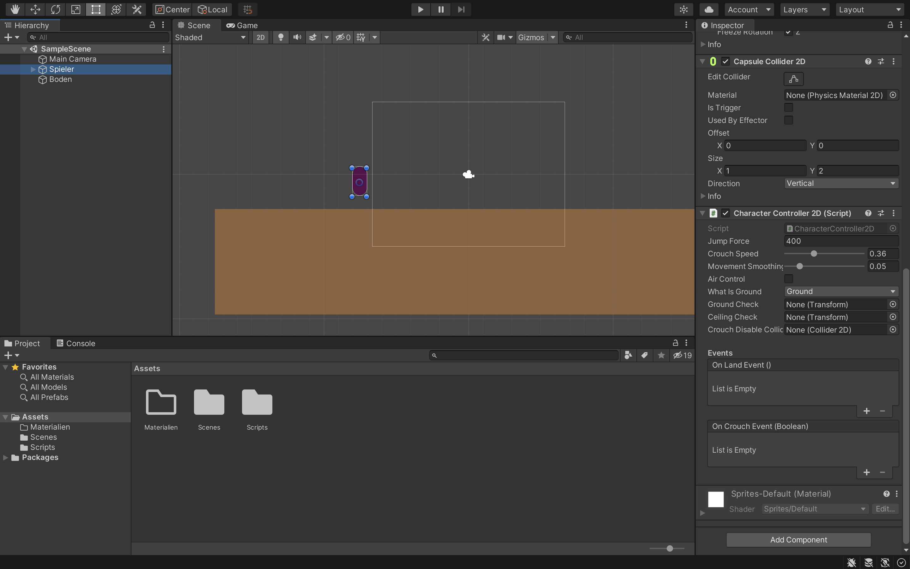
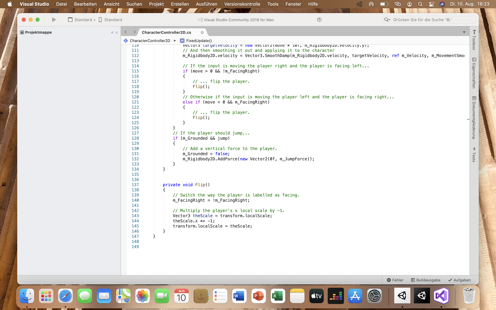

 # Informatik Projekt von Jannik und Thorge
 
 ## Inhaltsverzeichnis

1. [Projektseite](https://github.com/ThorgeHamprecht/Informatik-Projekt-Nr.-1/blob/main/2D%20Puzzle%20Game.md)
2. [ToDo-Liste](#ToDo)
3. [Stundenprotokoll](#prot)
4. [Arbeitsmethoden](#Methoden)
5. [Reflexion des Projekts](#Reflex)
6. [Spiel - Snap! Community Site](https://snap.berkeley.edu/project?user=faiture&project=2D%20Puzzle%20Game)
7. [Quellen](#Quellen)

  
 
 ## :heavy_check_mark:ToDo-Liste<a name="ToDo"></a>
 
Hier wird von nun an ([Mittwoch, 4. August](#zwei)) eine ToDo-Liste geführt, in der wir unsere Ziele und Fortschritte auf einen Blick sehen können.<br> 
Wir erhoffen uns damit mehr Übersicht während dieses Projekts zu behalten. Die ToDo-Liste wird aktuell gehalten werden und alte Beiträge werden der Übersichtlichkeit halber gelöscht. Gelöschte Beiträge finden sich aber in unserem Protokoll in dem Eintrag an ihrem Erstellungstag wieder.
 
- [x] *Anleitung Updaten*
- [ ] *A*
- [ ] *Texturen erstellen*
- [ ] *natürliche Level erstellen*
 
 
 ## :ledger:Stundenprotokoll<a name="prot"></a>
 
 <details>
<summary>Übersicht: Alle Einträge</summary>
<br>
 <table>
  <tr>
    <td><a href=#eins>Dienstag, 3. August</a></td>
    <td><a href=#zwei>Mittwoch, 4. August</a></td>
    <td><a href=#drei>Dienstag, 10. August</a></td>
    <td><a href=#vier>Mittwoch, 11. August</a></td>
    <td><a href=#fünf>Dienstag, 24. August</a></td>
  </tr>
  <tr>
    <td><a href=#sechs>Mittwoch, 25. August</a></td>
    <td><a href=#sieben>Dienstag, 31. August</a></td>
    <td><a href=#acht>Mittwoch, 1. September</a></td>
    <td><a href=#neun>Diesntag, 7. September</a></td>
    <td><a href=#zehn>Mittwoch, 8. September</a></td>
  </tr>
  <tr>
    <td><a href=#Ausfall1>Dienstag, 14. September</a></td>
    <td><a href=#Ausfall2>Mittwoch, 15. September</a></td>
    <td><a href=#elf>Mittwoch, 21. September</a></td>
    <td><a href=#zwölf>Mittwoch, 22. September</a></td>
    <td><a href=#dreizehn>Dienstag, 28. September</a></td>
  </tr>
  <tr>
    <td><a href=#Ausfall3>Mittwoch, 29. September</a></td>
    <td><a href=#vierzehn>Dienstag, 5. Oktober</a></td>
    <td><a href=#fünfzehn>Mittwoch, 6. Oktober</a></td>
    <td><a href=#sechzehn>Dienstag, 12. Oktober</a></td>
    <td><a href=#siebzehn>Mittwoch, 13. Oktober</a></td>
  </tr>
  <tr>
    <td><a href=#achtzehn>Dienstag. 19. Oktober</a></td>
    <td><a href=#neunzehn>Mittwoch, 20. Oktober</a></td>
    <td><a href=#zwanzig>Dienstag, 26. Oktober</a></td>
    <td><a href=#einundzwanzig>Mittwoch, 27. Oktober</a></td>
    <td><a href=#zweiundzwanzig>Dienstag, 2. November</a></td>
  </tr>
  <tr>
    <td><a href=#dreiundzwanzig>Mittwoch, 3. November</a></td>
    <td><a href=#Ausfall4>Dienstag, 9. November</a></td>
    <td><a href=#vierundzwanzig>Mittwoch, 10. November</a></td>
    <td><a href=#fünfundzwanzig>Dienstag, 16. November</a></td>
    <td><a href=#sechsundzwanzig>Mittwoch, 17. November</a></td>
  </tr>
  <tr>
    <td><a href=#siebenundzwanzig>Dienstag, 23. November</a></td>
    <td><a href=#achtundzwanzig>Mittwoch, 24. November</a></td>
    <td><a href=#neunundzwanzig>Dienstag, 30. November</a></td>
    <td><a href=#dreißig>Mittwoch, 1. Dezember</a></td>
    <td></td>
  </tr>
</table>
 
</details>

 
 ### Dienstag, 3. August<a name="eins"></a> 
 
Zunächst haben wir unseren GitHub Account erstellt. Danach haben wir dieses Repository ertsellt und uns über erste Möglichkeiten zur Bearbeitung auf GitHub anhand des Codes Ihres [*GitHub Repositorys*](https://github.com/jbuhl/InformatikUnterricht) informiert. Anschließend begann unser erstes Brainstorming zur Wahl eines Projekts. Dabei haben wir zunächst an die Entwicklung eines kleinen Spiels gedacht wollten anschließend jedoch leiber eine App entwicklen, da diese in unseren Augen langlebiger ist und nicht nur eine Art Gimick, dass einmal verwendung findet und danach überflüssig ist. Unsere erste Idee ist eine App mit deren Hilfe man seinen Kleiderschrank digital katalogisieren kann. Dabei wollten wir unter anderem das einspeichern von outfits, sowie einen Überblick über Kleidungsstücke, die sich zurzeit in der Wäsche befinden implementieren.

### Mittwoch, 4. August<a name="zwei"></a>

Heute haben wir uns weiter mit Markdown und unserem GitHub Directory beschäftigt. dabei haben wir gelernt,wie man Dropdowns einfügt:

```html
 <details>
    <summary>Zusammenfassung des Dropdowns</summary>
    <br>
     Hier gehören die Details und der weitere Inhalt hin.
    </details>
```
  
 Wie wir leider feststellen mussten, funktionieren eingebettete Links in Dropdowns nach normaler Markdown schreibweise nicht:<br>
 ` [Dienstag, 3. August](#eins)` Deshalb mussten wir stattdessen [*HTML*](https://de.wikipedia.org/wiki/Hypertext_Markup_Language) verwenden. Der Code hierfür war durch eine Recherche allerdings schnell zu finden: 
      
```html
<a href=HierDenLinkEinfügen>HierDenNamenEinfügen</a>
``` 
  
Und im Verlauf der Stunde haben wir uns auch das Einbetten von Code in unser Directory angeiegnet.
  
Außerdem haben wir uns angeschaut, wie man einen Ordner in seinem Repository anlegt und Dateien in diesem speichert. Wir haben hier nun zur Demonstration ein Bild hochgeladen und in unser Repository eingefügt.
  

  
Um unsere Arbeit besser Überblicken zu können haben wir folgendermaßen eine [**ToDo-Liste**](#ToDo) in unser Repository eingefügt:
      
    - [x] *Eine **ToDo-Liste** in unser Repository einfügen*
    - [x] *Mehr Struktur in unser Protokoll bringen*
    - [ ] *Umsetzbarkeit unserer App prüfen*
    - [ ] *Ersten Prototyp unseres Projekts anfertigen*
      
- [x] *Eine **ToDo-Liste** in unser Repository einfügen*
- [x] *Mehr Struktur in unser Protokoll bringen*
- [ ] *Umsetzbarkeit unserer App prüfen*
- [ ] *Ersten Prototyp unseres Projekts anfertigen*

### Dienstag, 10. August<a name="drei"></a> 

**Findung des geeigneten Programms zum Programmieren unserer App**

Sollten wir unsere App mit Swift programmieren?

Pro| Contra
------------ | -------------
• vermutlich "einfach" zu bedienen | • die App wird nicht auf Android funktionieren
• Apple-Design grafisch ansprechend | • eventuelle Online-Verfügbarkeit muss geprüft werden

Nach der letzten Stunde haben wir uns Zuhause nochn ein paar Gedanken über unsere App gemacht, dabei wollen wir nun eine ausschließliche IOS App mit [*XCode*](https://apps.apple.com/de/app/xcode/id497799835?mt=12) entwickeln. Wir haben uns für dieses Tool entschieden, da es einerseits die Programmiersprache [*Swift*](https://www.apple.com/de/swift/) beinhaltet, die auf das Programm abgestimmt sowie sehr anfängerfreundlich ist. Außerdem ist *XCode* ein First Party Tool und unterstützt damit alle Features der *IOS-Entwicklung*. Des weiteren wollen wir die App nur für eine Plattform entwicklen, um uns auf den wesentlichen Inhalt und nicht das optimieren beschäftigen zu müssen.

Hier ein kleines Beispiel zum reskalieren von Bildern. Somit kann man eine Art Collage in seinem Repository einfügen.
Der Code dafür sieht folgendermaßen aus:

```html
    
```
    
 

Außerdem ist es auch möglich ein Bild als Link zu verwenden und somit Youtube Videos interaktiv in sein Repository einzufügen.<br> 
Das Video lässt sich also druch anklicken des Bilds aufrufen.

<a href="http://www.youtube.com/watch?feature=player_embedded&v=LXb3EKWsInQ&ab_channel=Jacob%2BKatieSchwarz
" target="_blank"></a>

Auch dies ist wieder mit [*HTML*](https://de.wikipedia.org/wiki/Hypertext_Markup_Language) ermöglicht worden:

```html
<a href="http://www.youtube.com/watch?feature=player_embedded&v=LXb3EKWsInQ&ab_channel=Jacob%2BKatieSchwarz
" target="_blank"></a>
```

### Dienstag, 10. August<a name="drei"></a> 

In den letzen Tagen haben wir viel über unsere Projektidee des digitalen Kleiderschrankes nachgedacht. Wir sind zu dem Entschluss gekommen, das wir nicht weiter an dem Projekt des digitalen Kleiderschrankes festhalten wollen. Der hauptsächliche Grund stellt das Einscannen der Kleiderstücke dar. Man bräuchte zu große Datenmengen, damit jeder seine Kleidungsstücke digitalisieren kann. 
Aus diesem Grund hat die heutige Stunde für uns mit einem Brainstorming begonnen. Wir sind zu dem Entschluss gekommen, dass wir beide gerne ein Spiel entwerfen würden, das man zweidimensional spielen kann. Dabei sind uns zunächst zwei Ideen gekommen:
Die eine Möglichkeit stellt ein Spiel, nach dem Grundgedanken des Spiels "Subwaysurfers" da. Hierbei muss man einen Charakter nach links, rechts, oben oder unten bewegen, um Hindernissen auszuweichen. Schafft man dies nicht, muss man einen Lauf von Vorne beginnen. 
Eine andere Möglichkeit stellt ein Rätsel-Spiel da. Hierbei muss man mit einem Charakter Aufgaben z.B. in Form von Fragen lösen, um beispielsweise Türen zu öffnen oder um den Ausweg aus einem Labyrinth zu schaffen.
Wir haben uns nun entschieden diese beiden Gedanken zu kombinieren:
Wir möchten ein Spiel entwickeln, bei dem man einen Charakter zweidimensional von links nach rechts sowie von oben nach unten steuern kann. Dabei sollen dann Aufgaben gelöst werden, um weiter die Zielrichtung rechts zu erreichen. Über die genaue Art der Aufgaben haben wir uns bisher noch keine Gedanken gemacht.
Durch die neue Idee des Projekts haben wir uns auch überlegt, welches Programm wir benutzen wollen. Dabei sind wir auf [*Unity*](https://unity.com/de) gestoßen und haben nun vor mit der Programmiersprache [*C#*](https://de.wikipedia.org/wiki/C-Sharp) zu programmieren.
Aus diesem Grund haben wir das Programm [*Unity*](https://unity.com/de) heruntergeladen. 



In diesem Screenshot aus der Engine [*Unity*](https://unity.com/de) kann man die Anfänge unseres Projekts sehen. Unser genaues vorgehen wird mithilfe der folgenden Bilder erklärt.



Mit [Microsoft Visual Studio](https://visualstudio.microsoft.com/de/) bearbeiten wir den Code in [*C#*](https://de.wikipedia.org/wiki/C-Sharp), der für die einzelnen Scripts benötigt wird. 


### Mittwoch, 11. August<a name="vier"></a>

Da die Stunde ausfiel haben wir uns ein paar Schritte überlegt, die wir als nächstes verfolgen wollen.
- [ ] *Musik für das Spiel erstellen*
- [ ] *Animationen erstellen*
- [ ] *Texturen erstellen*
- [x] *natürliche Level erstellen*

### Dienstag, 24. August<a name="fünf"></a>

Nachdem wir unseren Spieler in der letzten Stunde kontrollierbar gemacht haben, arbeiteten wir an den Animationen für unseren Spieler. Dabei ist wichtig, dass die einzelenen Animationen in den richtigen Momenten abgespielt werden. Dafür benutzten wir Unitys integrierten Animation-Controller nutzen, der es einem vereinfacht den Code und die Animationen zu verbinden. Im Code werden hierbei bei bestimmten Ereignissen bestimmte Animationen getriggert. Das Animieren selber ist derzeit über Keyframes sehr einfach durchzuführen. Da es sich bei unseren Sprites derzeit aber nur um Platzhalter handelt werden diese später ausgetauscht.


### Mittwoch, 25. August<a name="sechs"></a>

Heute haben wir uns mit Ihnen über unsere Projektidee ausgetauscht. Sie äußerten das Bedenken, dass wir in C# programmieren. Außerdem müssen wir für Sie deutlich machen, welchen Teil des Codes wir selbst programmiert haben und welchen Teil des Codes wir aus dem Internet übernommen haben. 
Anschließend haben wir weiter an dem Level-Aufbau gearbeitet.

### Dienstag, 31.08.2021 <a name="sieben"></a>

Nach dem Gespräch mit Ihnenn sind wir zu dem Entschluss, dass wir nicht an dem Programmieren in Unity mit der Programmiersprache C# festahlten wollen. Wir wollen nun mit Snap arbeiten. Zuhause haben wir uns bereits mit der Realisierung unseres Projektes mit dem Programm Snap beschäftigt. 
Wir haben bereits einige Stages erstellt und einen Spieler mit den Eigenscdhaften Springen laufen und .... erstellt. 
Im Untericht haben wir Ihnen unseren Fortschritt mit Snap gezeigt. 

### Mittwoch, 01.09.2021 <a name="acht"></a>

Heute haben wir uns mit der Optimierung unseres Spieles beschäftigt. Mit der Website Piskel haben wir unsere Hintergrund Stage erstellt, in der sich unsere Figur bewegt. Anschließend haben wir uns mit der schlechten Performence beschäftigt und versucht diese zu Optimieren. Dafür haben wir

### Dienstag, 07.09.2021 <a name="neun"></a>

Heute wollten wir eine Schranke einbauen, welche die Spielfigur passieren muss, um nicht in einem Lava zu sterben. 
Dafür haben wir bei Piskel eine provisorische Schranke erstellt, welche wir anschließend programmieren wollten. 
Wir sind nach einigem Probieren zu dem Entschluss gekommen, dass wir die Schranke durch einen Knopf ersetzen wollen. Dies ist nach unserer Bewertung anschaulicher, da es sich um ein 2D Projekt und nicht um ein 3D Projekt handelt.
Unsere Vorstellung ist das, wenn sich der Charakter auf dem Knopf befindet, die Lava erschwinden und der Charakter kann weiter in Richtung des Ziels laufen. Dabei war das Hauptptoblem, dass wenn die Figur auf den Knopf befindet, die Lava immer schnell hintereinander verschwindet und wiederkommt. Das ist logischerweise auf den Befehl "when touching "Knopf"" zurückzuführen, bei dem dieser Befehl immer wieder schnell hintereinander ausgeführt wird. 
Um dieses Problem zu entgehen, haben wir den Code dahingehend erweitert, dass das Verschwinden und Wiedererscheinen der Lava nur mit einem zeitlichen Abstand von einer Sekunde passiert. Diese gewählte Zeit ist vor allem deshalb gut, weil somit zwar direkt beim Berühren des Knopfes die Lava verschwindet, sie jedoch nicht hin und her springt (nur wenn man auf dem Knopf stehen bleibt nach einer Sekunde) Verlässt der Charakter den Knopf und berührt anschließend wieder den Knopf ist eine Sekunde ebenfalls vergangen und er Befehl kann ohne Zeitverzug ausgeführt werden. 

### Mittwoch, 08.09.2021 <a name="zehn"></a>

### Dienstag, 14.09.2021 <a name="Ausfall1"></a>

### Mittwoch, 15.09.2021 <a name="Ausfall2"></a>

### Dienstag, 21.09.2021 <a name="elf"></a>
Zuhause haben wir versucht, den Hintergrund zu animieren. Dafür haben wir eingestellt, an welcher Stelle die Wolken im Hintergrund erscheinen sollen uns mit welcher Geschwindigkeit sie sich anschließend in welche Richtung bewegen sollen. 
Heute ging es darum, neue Stages zu erstellen, damit sich eine "neue" Welt öffnet, wenn sich der Charakter aus den Rändern links und rechts bewegt. 

### Mittwoch, 22.09.2021 <a name="zwölf"></a>
In der heutigen Stunde haben wir unser GitHub Repository überarbeitet. Dabei haben wir neue Dinge 

### Dienstag, 28.09.2021 <a name="dreizehn"></a>
Heute haben wir den Start unseres Spiel programmiert. Zunächst haben wir einen Platzhalter eingefügt, welcher einen Start-Knopf simulieren sollte. Danach haben wir ein PNG erstellt, welches die Überschrift "Spiel Starten" aufzeigt. Dieses Startmenü soll immer dann erscheinen, wenn man das Spiel das erste Mal starten möchte und immer dann, wenn man ein Leben verloren hat. Anschließend haben wir uns mit einem plötzlich aufgetretenden Problem befasst. Wenn wir mit der Spielfigur auf die Lava kommen wird zunächst wie gewollt ein halbes Leben abgezogen. Anschließend, wenn der Charakter nur noch 1,5 Leben hat, wird jedoch plötzlich ein ganzes Leben abgezogen. Um diesem Probklem zu beheben, haben wir unseren Code noch einmal genau untersucht. Zunächst lag nahe, dass sich ein Fehler in dem Sprite des zweiten Lebens befindet. Hier konnten wir jedoch auch durch veränderung des Codes und Ausprobieren keinen Fehler identifizieren. Aus diesem Grund liegt Nahe, dass sich der Fehler bei den Hauptdefinitionen der Stage befindet.

### Mittwoch, 29.09.2021 <a name="Ausfall3"></a>

### Dienstag, 5.10.2021 <a name="vierzehn"></a>

Heute haben wir das Spielmenü erstellt. Dabei haben wir mit Power-Point verschiedene Bilder erstellt, um diese zu erstellen.
Zudem haben wir uns damit befasst, dass Problem mit den Leben zu lösen. Nach einigem probieren sind wir auf folgende Lösung gekommen, mit der die Leben nun wieder in gewünschter Weise weniger werden.
Folgend haben wir uns damit beschäftigt einen Fehler bei dem verlassen von Stages beschäftigt. 

### Mittwoch, 6.10.2021 <a name="fünfzehn"></a>

### Dienstag, 12.10.2021 <a name="sechzehn"></a>

### Mittwoch, 13.10.2021 <a name="siebzehn"></a>

### Dienstag, 19.10.2021 <a name="achtzehn"></a>

### Mittwoch, 20.10.2021 <a name="neunzehn"></a>

### Dienstag, 26.10.2021 <a name="zwanzig"></a>

### Mittwoch, 27.10.2021 <a name="einundzwanzig"></a>

### Dienstag, 2.11.2021 <a name="zweiundzwanzig"></a>

### Mittwoch, 3.11.2021 <a name="dreiundzwanzig"></a>

### Dienstag, 9.11.2021 <a name="Ausfall4"></a>

### Mittwoch, 10.11.2021 <a name="vierundzwanzig"></a>

### Dienstag, 16.11.2021 <a name="füfnundzwanzig"></a>

### Mittwoch, 17.11.2021 <a name="sechsundzwanzig"></a>

### Dienstag, 23.11.2021 <a name="siebenundzwanzig"></a>

### Mittwoch, 24.11.2021 <a name="achtundzwanzig"></a>

### Dienstag, 30.11.2021 <a name="neunundzwanzig"></a>

### Mittwoch, 1.12.2021 <a name="dreißig"></a>


PDF für alle Menüelemente
<BODY>
  
</BODY>


## 🔧Arbeitsmethoden<a name="Methoden"></a>

### 🎨Sprite Erstellung

### 🎵Musik Erstellung

## 📥Reflexion des Projekts<a name="Reflex"></a>

## ℹ️Quellen<a name="Quellen"></a>


